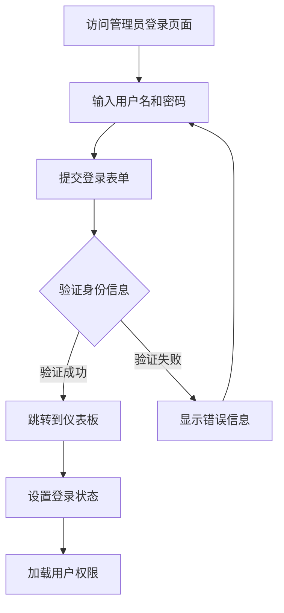
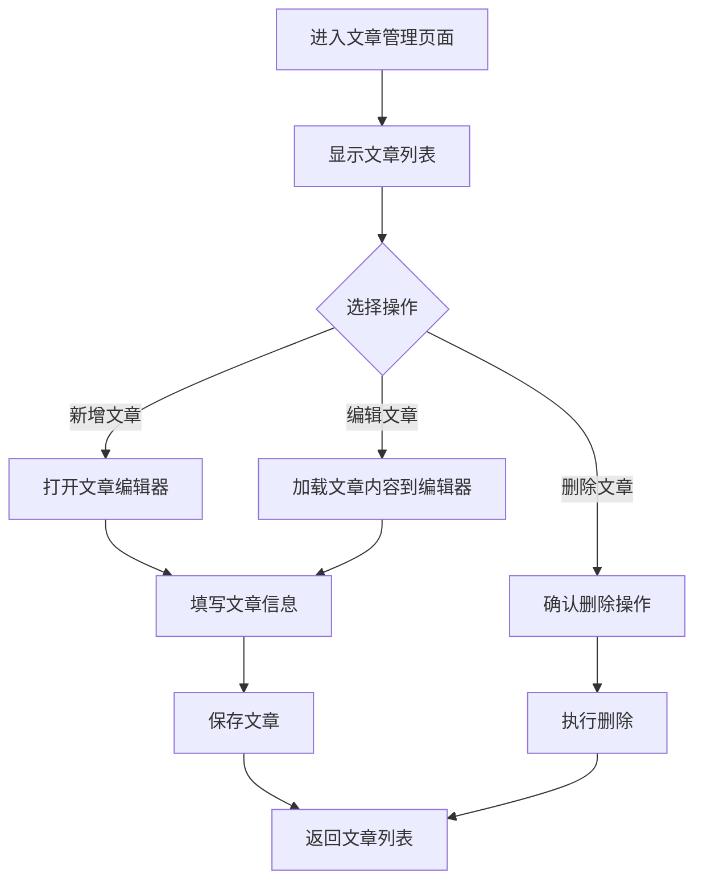

# 管理员模块详细设计文档

## 1. 模块概述

管理员模块是自媒体作者个人网站的核心管理系统，提供完整的后台管理功能，包括内容管理、数据统计、系统配置等功能。该模块确保网站内容的安全性和可维护性。

## 2. 核心功能

### 2.1 用户角色

| 角色 | 权限描述 | 访问范围 |
|------|----------|----------|
| 超级管理员 | 拥有所有权限，包括系统配置和用户管理 | 全部功能模块 |
| 内容管理员 | 负责文章和社交平台内容管理 | 文章管理、社交平台管理 |

### 2.2 功能模块

管理员后台包含以下核心功能模块：

1. **管理员登录页面**：安全的身份验证入口
2. **仪表板页面**：数据概览和快速操作
3. **文章管理页面**：文章的增删改查操作
4. **社交平台管理页面**：社交媒体账号和链接管理
5. **网站统计管理页面**：访问数据和统计信息管理
6. **管理员账户管理页面**：管理员信息和权限设置

### 2.3 页面详情

| 页面名称 | 模块名称 | 功能描述 |
|----------|----------|----------|
| 管理员登录页面 | 身份验证模块 | 用户名密码登录、记住登录状态、安全验证 |
| 仪表板页面 | 数据概览模块 | 显示网站关键指标、最新文章、待处理事项 |
| 文章管理页面 | 文章管理模块 | 文章列表展示、新增文章、编辑文章、删除文章、文章状态管理 |
| 社交平台管理页面 | 社交平台模块 | 平台列表管理、添加新平台、编辑平台信息、排序设置 |
| 网站统计管理页面 | 统计数据模块 | 查看访问统计、粉丝增长趋势、文章阅读量统计 |
| 管理员账户管理页面 | 账户管理模块 | 修改密码、个人信息设置、权限查看 |

## 3. 核心流程

### 3.1 管理员登录流程



### 3.2 文章管理流程



## 4. 用户界面设计

### 4.1 设计风格

- **主色调**：深蓝色 (#1e40af) 和白色 (#ffffff)
- **辅助色**：灰色 (#6b7280) 和绿色 (#10b981)
- **按钮样式**：圆角矩形，悬停效果
- **字体**：系统默认字体，标题 18px，正文 14px
- **布局风格**：侧边栏导航 + 主内容区域
- **图标风格**：线性图标，统一风格

### 4.2 页面设计概览

| 页面名称 | 模块名称 | UI元素 |
|----------|----------|--------|
| 管理员登录页面 | 登录表单 | 居中卡片布局，用户名输入框，密码输入框，登录按钮，记住我选项 |
| 仪表板页面 | 统计卡片 | 网格布局，数据卡片，图表组件，快速操作按钮 |
| 文章管理页面 | 数据表格 | 搜索框，新增按钮，文章列表表格，分页组件，操作按钮 |
| 社交平台管理页面 | 平台卡片 | 平台卡片网格，添加按钮，编辑模态框，拖拽排序 |
| 网站统计管理页面 | 图表展示 | 统计图表，数据筛选器，导出功能，时间范围选择 |
| 管理员账户管理页面 | 设置表单 | 个人信息表单，密码修改表单，权限展示区域 |

### 4.3 响应式设计

- **桌面端优先**：主要针对桌面端管理操作优化
- **平板适配**：侧边栏可折叠，保持核心功能可用
- **移动端支持**：基础查看功能，简化操作界面

## 5. 安全性设计

### 5.1 身份验证

- **登录验证**：用户名密码验证，支持记住登录状态
- **会话管理**：基于 JWT Token 的会话管理
- **权限控制**：基于角色的访问控制 (RBAC)
- **登录保护**：防止暴力破解，登录失败次数限制

### 5.2 数据安全

- **输入验证**：所有用户输入进行严格验证和过滤
- **SQL注入防护**：使用参数化查询
- **XSS防护**：输出内容进行转义处理
- **CSRF防护**：使用 CSRF Token 验证

### 5.3 操作日志

- **登录日志**：记录所有登录尝试
- **操作日志**：记录所有数据修改操作
- **错误日志**：记录系统错误和异常

## 6. 技术实现

### 6.1 前端技术栈

- **框架**：Vue 3 + TypeScript
- **UI组件库**：Element Plus
- **状态管理**：Pinia
- **路由管理**：Vue Router
- **HTTP客户端**：Axios

### 6.2 后端集成

- **数据库**：Supabase PostgreSQL
- **身份验证**：Supabase Auth
- **文件存储**：Supabase Storage
- **实时更新**：Supabase Realtime

### 6.3 数据模型扩展

需要在现有数据库基础上添加以下表结构：

```sql
-- 管理员操作日志表
CREATE TABLE admin_logs (
    id UUID PRIMARY KEY DEFAULT gen_random_uuid(),
    admin_id UUID REFERENCES admin(id),
    action VARCHAR(100) NOT NULL,
    target_type VARCHAR(50),
    target_id VARCHAR(100),
    details JSONB,
    ip_address INET,
    user_agent TEXT,
    created_at TIMESTAMP WITH TIME ZONE DEFAULT NOW()
);

-- 系统配置表
CREATE TABLE system_config (
    id UUID PRIMARY KEY DEFAULT gen_random_uuid(),
    config_key VARCHAR(100) UNIQUE NOT NULL,
    config_value TEXT,
    description TEXT,
    updated_by UUID REFERENCES admin(id),
    updated_at TIMESTAMP WITH TIME ZONE DEFAULT NOW()
);
```

## 7. 部署和维护

### 7.1 部署要求

- **环境要求**：Node.js 18+, 现代浏览器支持
- **依赖服务**：Supabase 服务正常运行
- **安全配置**：HTTPS 部署，环境变量配置

### 7.2 监控和维护

- **性能监控**：页面加载时间，API响应时间
- **错误监控**：前端错误收集，后端异常监控
- **安全监控**：异常登录检测，权限变更监控

### 7.3 备份策略

- **数据备份**：定期数据库备份
- **配置备份**：系统配置和环境变量备份
- **代码备份**：版本控制和代码仓库管理

## 8. 用户体验优化

### 8.1 操作便捷性

- **快捷键支持**：常用操作的键盘快捷键
- **批量操作**：支持批量选择和操作
- **自动保存**：表单内容自动保存草稿
- **操作提示**：清晰的操作反馈和提示信息

### 8.2 性能优化

- **懒加载**：大数据列表的分页和懒加载
- **缓存策略**：合理的数据缓存机制
- **压缩优化**：静态资源压缩和优化
- **CDN加速**：静态资源CDN分发

### 8.3 可访问性

- **键盘导航**：完整的键盘操作支持
- **屏幕阅读器**：语义化HTML和ARIA标签
- **色彩对比**：符合WCAG标准的色彩对比度
- **字体大小**：支持字体大小调节

---

**文档版本**：v1.0  
**创建日期**：2024-12-19  
**最后更新**：2024-12-19  
**负责人**：开发团队