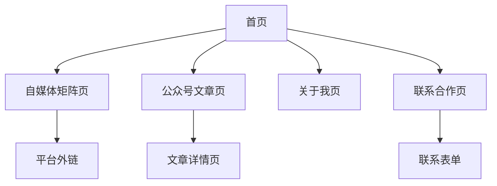

# 夏叶的AI加油站个人网站产品需求文档

## 1. 产品概述

本项目旨在为"夏叶的AI加油站"打造一个专业的个人品牌展示网站，集中展示个人介绍、自媒体矩阵、公众号文章和联系方式。
- 帮助"夏叶的AI加油站"建立专业的线上形象，提升个人品牌影响力，为商业合作提供展示平台。
- 目标用户包括粉丝、潜在合作伙伴、广告主等，通过统一的展示平台了解"夏叶的AI加油站"的全方位信息。

## 2. 核心功能

### 2.1 用户角色

| 角色 | 访问方式 | 核心权限 |
|------|----------|----------|
| 访客用户 | 直接访问网站 | 浏览所有公开内容，查看公众号文章，获取联系方式 |
| 网站管理员 | 后台管理系统 | 更新内容，同步公众号文章，查看访问统计 |

### 2.2 功能模块

本网站包含以下核心页面：
1. **首页**：个人介绍、核心亮点展示、最新动态预览
2. **自媒体矩阵页**：各平台账号展示、粉丝数据、平台链接
3. **公众号文章页**：展示同步的微信公众号文章
4. **关于我页**：详细个人介绍、成长历程、专业技能
5. **联系合作页**：联系方式、合作案例、商务信息

### 2.3 页面详情

| 页面名称 | 模块名称 | 功能描述 |
|----------|----------|----------|
| 首页 | 英雄区域 | 展示个人头像、姓名、核心标签，吸引眼球的视觉设计 |
| 首页 | 数据概览 | 显示总粉丝数、作品数量、合作品牌数等关键数据 |
| 首页 | 最新动态 | 展示最近发布的3-5篇公众号文章预览，支持快速跳转 |
| 自媒体矩阵页 | 平台展示 | 展示微博、抖音、小红书、B站等平台信息和链接 |
| 自媒体矩阵页 | 数据统计 | 各平台粉丝数、互动数据的可视化展示 |
| 公众号文章页 | 文章列表 | 展示同步的公众号文章列表，包含标题、摘要、发布时间 |
| 公众号文章页 | 文章详情 | 点击查看文章详细内容，支持跳转到原公众号文章 |
| 公众号文章页 | 文章搜索 | 支持按标题关键词搜索文章 |
| 关于我页 | 个人简介 | 详细的个人背景、专业经历、创作理念 |
| 关于我页 | 技能标签 | 展示专业技能、擅长领域、创作风格 |
| 关于我页 | 成就展示 | 重要奖项、里程碑事件、媒体报道 |
| 联系合作页 | 联系方式 | 邮箱、微信、电话等多种联系方式 |
| 联系合作页 | 合作案例 | 展示过往合作品牌、项目案例、合作效果 |
| 联系合作页 | 商务信息 | 合作类型、报价范围、合作流程说明 |

## 3. 核心流程

**访客浏览流程：**
访客进入网站首页，通过英雄区域了解"夏叶的AI加油站"基本信息，查看数据概览了解影响力，浏览最新动态获取最新内容。然后可以访问自媒体矩阵页了解各平台账号，进入公众号文章页查看历史文章，通过关于我页深入了解作者背景，最后在联系合作页获取合作信息。

**管理员内容更新流程：**
管理员登录后台系统，可以更新个人信息、同步公众号文章、更新平台数据、管理合作案例，确保网站内容的时效性和准确性。

## 4. 用户界面设计

### 4.1 设计风格

- **主色调**：深蓝色(#1a365d)作为主色，白色(#ffffff)作为背景色
- **辅助色**：橙色(#ed8936)用于强调和按钮，灰色(#718096)用于次要文本
- **按钮样式**：圆角矩形按钮，支持悬停效果和渐变背景
- **字体**：中文使用"PingFang SC"，英文使用"Inter"，标题18-32px，正文14-16px
- **布局风格**：现代卡片式设计，顶部导航栏，网格布局展示内容
- **图标风格**：使用简洁的线性图标，支持品牌色彩和悬停动画

### 4.2 页面设计概览

| 页面名称 | 模块名称 | UI元素 |
|----------|----------|--------|
| 首页 | 英雄区域 | 全屏背景图，居中头像(120px圆形)，大标题(32px粗体)，副标题(18px)，CTA按钮 |
| 首页 | 数据概览 | 4列网格布局，每列包含数字(28px粗体)和标签(14px)，卡片阴影效果 |
| 首页 | 最新动态 | 3列响应式网格，文章卡片包含封面图、标题、摘要、发布时间 |
| 自媒体矩阵页 | 平台展示 | 2x3网格布局，每个平台卡片包含logo、平台名、粉丝数、跳转按钮 |
| 公众号文章页 | 文章搜索 | 顶部搜索框，支持实时搜索和关键词高亮 |
| 公众号文章页 | 文章列表 | 垂直列表布局，每项包含封面图、标题、摘要、发布时间 |
| 关于我页 | 个人简介 | 左右分栏布局，左侧头像和基本信息，右侧详细介绍 |
| 联系合作页 | 联系方式 | 图标+文字的垂直列表，支持一键复制和跳转 |

### 4.3 响应式设计

网站采用移动优先的响应式设计，在桌面端(1200px+)、平板端(768-1199px)和移动端(<768px)都有良好的显示效果。移动端优化包括触摸友好的按钮尺寸、简化的导航菜单、垂直堆叠的布局等。