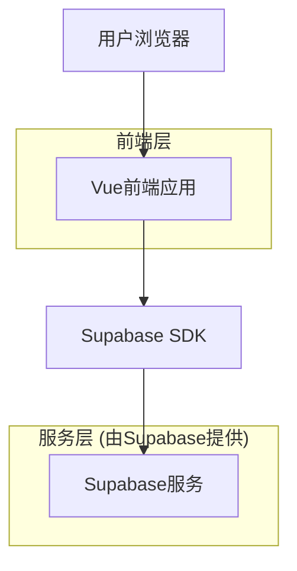
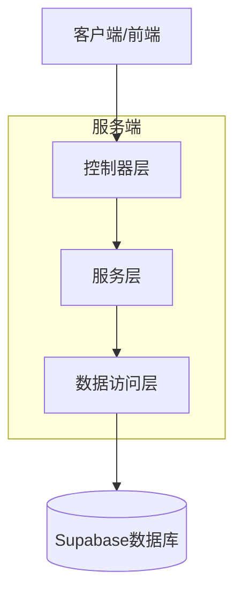
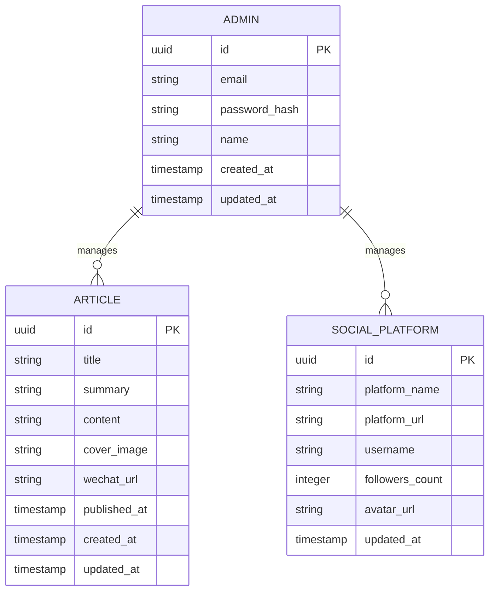

# 夏叶的AI加油站个人网站技术架构文档

## 1. 架构设计



## 2. 技术描述

* **前端**: Vue\@3 + TypeScript\@5 + Vite\@5 + TailwindCSS\@3

* **后端**: Supabase (提供数据库、认证、存储服务)

* **部署**: Vercel (前端托管)

## 3. 路由定义

| 路由             | 用途                  |
| -------------- | ------------------- |
| /              | 首页，展示个人介绍、数据概览和最新动态 |
| /social        | 自媒体矩阵页，展示各平台账号和数据统计 |
| /articles     | 公众号文章页，展示同步的公众号文章       |
| /articles/:id | 文章详情页，展示单个文章的详细信息   |
| /about         | 关于我页，详细个人介绍和成就展示    |
| /contact       | 联系合作页，联系方式和商务信息     |
| /admin         | 管理后台，内容管理和数据更新      |
| /admin/login   | 管理员登录页              |

## 4. API定义

### 4.1 核心API

**用户认证相关**

```
POST /auth/v1/token
```

请求参数:

| 参数名      | 参数类型   | 是否必需 | 描述    |
| -------- | ------ | ---- | ----- |
| email    | string | true | 管理员邮箱 |
| password | string | true | 管理员密码 |

响应参数:

| 参数名           | 参数类型   | 描述   |
| ------------- | ------ | ---- |
| access\_token | string | 访问令牌 |
| user          | object | 用户信息 |

**公众号文章相关**

```
GET /rest/v1/articles
POST /rest/v1/articles/sync
GET /rest/v1/articles/:id
```

**平台数据相关**

```
GET /rest/v1/social_platforms
PUT /rest/v1/social_platforms/:id
```

## 5. 服务架构图



## 6. 数据模型

### 6.1 数据模型定义



### 6.2 数据定义语言

**管理员表 (admins)**

```sql
-- 创建管理员表
CREATE TABLE admins (
    id UUID PRIMARY KEY DEFAULT gen_random_uuid(),
    email VARCHAR(255) UNIQUE NOT NULL,
    password_hash VARCHAR(255) NOT NULL,
    name VARCHAR(100) NOT NULL,
    created_at TIMESTAMP WITH TIME ZONE DEFAULT NOW(),
    updated_at TIMESTAMP WITH TIME ZONE DEFAULT NOW()
);

-- 创建索引
CREATE INDEX idx_admins_email ON admins(email);

-- 设置权限
GRANT SELECT ON admins TO anon;
GRANT ALL PRIVILEGES ON admins TO authenticated;
```

**文章表 (articles)**
```sql
-- 创建文章表
CREATE TABLE articles (
    id UUID PRIMARY KEY DEFAULT gen_random_uuid(),
    title VARCHAR(255) NOT NULL,
    summary TEXT,
    content TEXT,
    cover_image VARCHAR(500),
    wechat_url VARCHAR(500),
    published_at TIMESTAMP WITH TIME ZONE,
    created_at TIMESTAMP WITH TIME ZONE DEFAULT NOW(),
    updated_at TIMESTAMP WITH TIME ZONE DEFAULT NOW()
);

-- 创建索引
CREATE INDEX idx_articles_published_at ON articles(published_at DESC);
CREATE INDEX idx_articles_title ON articles(title);

-- 设置权限
GRANT SELECT ON articles TO anon;
GRANT ALL PRIVILEGES ON articles TO authenticated;
```

**社交平台表 (social\_platforms)**

```sql
-- 创建社交平台表
CREATE TABLE social_platforms (
    id UUID PRIMARY KEY DEFAULT gen_random_uuid(),
    platform_name VARCHAR(50) NOT NULL,
    platform_url VARCHAR(500),
    username VARCHAR(100),
    followers_count INTEGER DEFAULT 0,
    avatar_url VARCHAR(500),
    updated_at TIMESTAMP WITH TIME ZONE DEFAULT NOW()
);

-- 创建索引
CREATE INDEX idx_social_platforms_name ON social_platforms(platform_name);

-- 设置权限
GRANT SELECT ON social_platforms TO anon;
GRANT ALL PRIVILEGES ON social_platforms TO authenticated;

-- 初始化数据
INSERT INTO social_platforms (platform_name, platform_url, username, followers_count) VALUES
('微博', 'https://weibo.com/', '', 0),
('抖音', 'https://www.douyin.com/', '', 0),
('小红书', 'https://www.xiaohongshu.com/', '', 0),
('B站', 'https://www.bilibili.com/', '', 0),
('微信公众号', '', '', 0),
('知乎', 'https://www.zhihu.com/', '', 0);
```


